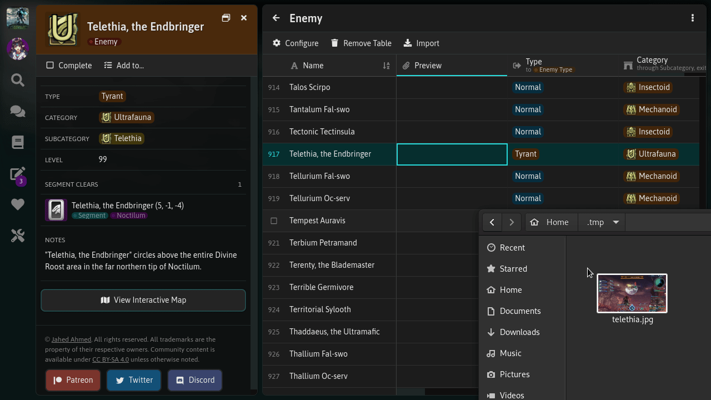

# Data Tables

Data Tables are the primary interface for editing data.

## Presentation

Data Tables are organised as follows based on the "[Data Model](data-model.md)":

* Table are Entity Types
* Rows are Entities
* Columns are Properties
* Data are Cells.
* A Relationship is a Cell under a Relationship Type Column.

## General Usage

Use "[Universal Search](../navigation/universal-search.md)" to navigate to different Tables and create new ones.

**LeftClick** a Column Heading to sort the Rows based on that Column.

**RightClick** a Column Heading to:

* Rename the Column
* Delete the Column

**RightClick** a Row to:

* Delete the Row
* Move the Row to another Table.
  * The destination Table must have the same existing Columns.
  * Currently, moving rows with existing relationships is not supported.
  * This is mainly to move Rows in Placeholder tables.

**LeftClick** any Cell, then **CTRL + E** to create a new Row.

## Marking Multiple Rows

You can mark multiple Rows to perform bulk operations such as removing and filling.

**Hold LeftClick + Drag** to mark multiple Rows.

**LeftClick** a Cell, then **SHIFT + LeftClick** another Cell to mark a range of Rows.

**LeftClick** a Cell, then **CTRL + SHIFT + LeftClick** another Cell to unmark a range of Rows.

**LeftClick** the Row Number Cell to mark/unmark a single Row.

## Filling Multiple Cells

To speed up data entry, you can:

1. Mark multiple Rows \(see above\)
2. Select an unmarked Cell
3. Click "Fill" in the toolbar to update the marked Rows with the value of the selected Cell.
4. Unmark the Rows if you want to.

Note: The selected Cell cannot be among your marked Rows.

For Relationships, filling will add all of the Relationships from the selected Cell to the marked Rows. It won't remove any Relationships.

If a Relationship already exists, Fill will fail to avoid inconsistent updates. This will result in a partial fill as the Rows before the failure will be updated. Use the Rewind Changes feature to unfill those Rows if you want to.

## Drag and Drop

Some cells such as Attachments \(Images, Files\) support drag-and-drop from your File Manager so you don't need to hunt down files your already have open.

